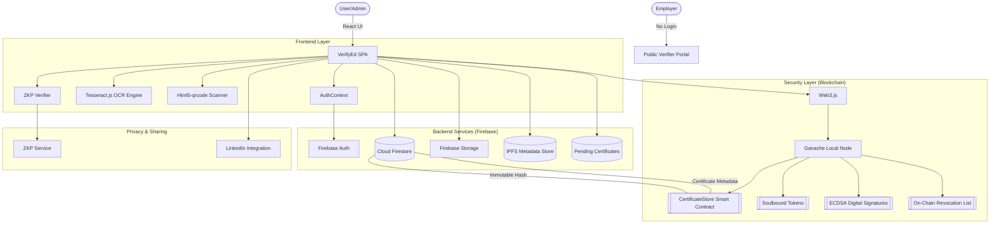
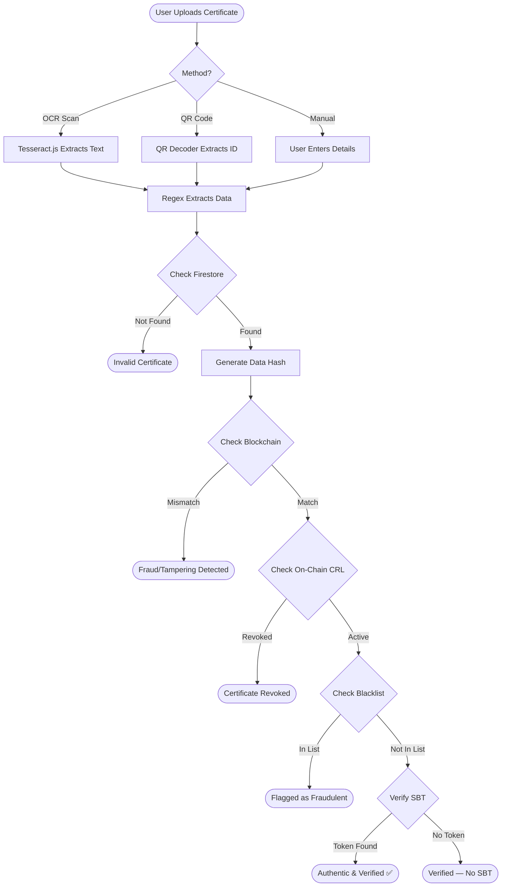

# VerifyEd: Blockchain & AI Powered Certificate Verification

VerifyEd is a high-security, transparent academic certificate verification platform. It solves the problem of fraudulent academic credentials by creating a **"Dual-Verification"** system that combines **Firebase's** high-speed data delivery with the **Ethereum Blockchain's (via Ganache)** immutable security records — enhanced with **IPFS**, **Soulbound Tokens**, **Zero-Knowledge Proofs**, and **Multi-Signature Governance**.

---

## 🏗 System Architecture



---

## ✨ Advanced Blockchain Features

### 1. 📦 IPFS Decentralized Storage
- Content-addressed storage using SHA-256 CID generation
- Certificate metadata stored in Firestore `ipfs_objects` collection
- Automatic IPFS upload on certificate creation
- Gateway URL generation for decentralized access

### 2. 💎 Soulbound Tokens (SBTs)
- Non-transferable NFTs minted on-chain for each certificate
- Token ID format: `SBT-{timestamp}-{counter}`
- Bound to the holder's identity — cannot be sold or transferred
- Lookup by certificate number via block scanning

### 3. ✍️ Digital Signatures (ECDSA)
- Certificates are cryptographically signed using the institution's Ethereum wallet
- Signature stored on-chain alongside the certificate hash
- Verification via `eth.accounts.recover` to validate signer authenticity

### 4. 🔐 Zero-Knowledge Proofs (ZKP)
- Prove claims about a certificate **without revealing private data**
- 5 supported claim types:
  - `has_degree` — Proves the holder has a degree
  - `gpa_above` — Proves GPA exceeds a threshold
  - `graduated_before` / `graduated_after` — Proves graduation year range
  - `institution_match` — Proves attendance at a specific institution
- SHA-256 commitment + nonce-based proof generation

### 5. 🖊️ Multi-Signature Approval
- Certificates require **2+ admin signatures** before on-chain finalization
- Pending certificates tracked in `pending_certificates` Firestore collection
- Admin dashboard section for viewing and approving pending items
- Automatic on-chain storage once threshold is met

### 6. 🌐 Public Verifier Portal
- Standalone verification page at `/verify` — **no login required**
- Displays blockchain verification, SBT, and revocation badges
- Designed for employers and third-party verifiers

### 7. 🚫 On-Chain Revocation List (CRL)
- Enhanced revocation with **reason** and **audit trail**
- `checkRevocationOnChain`: scans blocks for revocation records
- `getRevocationHistory`: returns full chronological audit trail
- Revocation status displayed in verification results

### 8. 🔗 LinkedIn Integration
- "Add to LinkedIn Profile" button for verified certificates
- Pre-filled LinkedIn certification URL with degree, institution, year, and cert ID
- Styled with LinkedIn brand colors

---

## 📐 Structure Plan (Development Phases)

### Phase 1: Foundation & Project Scaffolding
- **React Migration**: Converted legacy HTML/JS codebase into a modular React SPA.
- **Environment Setup**: Configured Vite, ESLint, and environment variables.
- **Design System**: Integrated the original CSS framework for React's component architecture.

### Phase 2: Security & Backend Integration
- **Firebase Core**: Authentication (RBAC), Cloud Firestore for metadata, and Storage for files.
- **Blockchain Notarization**: Web3 provider for Ganache and Keccak-256 hashing strategy.
- **On-Chain Logic**: `CertificateStore.sol` smart contract for decentralized verification.

### Phase 3: AI & Enhanced UX
- **OCR Engine**: Tesseract.js for client-side image processing.
- **QR Integration**: Hardware-accelerated QR scanning.
- **Automated Verification**: Auto-fill forms and verify data instantly after scanning.

### Phase 4: Advanced Blockchain Features
- **Decentralized Storage**: IPFS CID-based content addressing.
- **Token Economy**: Soulbound Tokens for non-transferable credential NFTs.
- **Cryptographic Signatures**: ECDSA signing and verification.
- **Privacy Preservation**: Zero-Knowledge Proof engine for selective disclosure.
- **Governance**: Multi-signature approval workflows for institutional governance.
- **Public Access**: No-login verifier portal for employers.
- **Audit Trail**: On-chain revocation list with full history.
- **Professional Sharing**: LinkedIn certification integration.

---

## 🔄 Verification Workflow Diagram



---

## 📂 Folder Structure

```text
IOT BASED BLOCKCHAIN/
├── contracts/               # Solidity Smart Contracts (Blockchain logic)
├── public/                  # Static assets & Sample Certificates
├── src/
│   ├── components/
│   │   ├── Hero.jsx         # Landing page hero section
│   │   ├── LoginModal.jsx   # Firebase Auth login modal
│   │   ├── AdminDashboard.jsx # Certificate management + Multi-Sig approvals
│   │   ├── ResultsSection.jsx # Verification results + SBT/IPFS/LinkedIn panels
│   │   ├── ZKPVerifier.jsx  # Zero-Knowledge Proof verification UI
│   │   ├── PublicVerifier.jsx # Public verification portal (no login)
│   │   ├── LinkedInShare.jsx  # LinkedIn certification share button
│   │   └── ...              # Other UI components
│   ├── contexts/            # State Management (AuthContext for RBAC)
│   ├── services/
│   │   ├── certificateService.js  # Firestore + Blockchain + IPFS integration
│   │   ├── ipfsService.js         # IPFS decentralized storage
│   │   ├── zkpService.js          # Zero-Knowledge Proof engine
│   │   └── multiSigService.js     # Multi-signature approval workflow
│   ├── blockchain.js        # Web3, SBTs, ECDSA, CRL, Ganache interaction
│   ├── firebase.js          # Firebase SDK Initialization
│   ├── App.jsx              # Root Component & Layout + Public Verifier route
│   └── index.css            # Global Styles & Animations
├── .env                     # Private Keys & Connection URLs
├── firebase.json            # Deployment Config
└── package.json             # Project Dependencies
```

---

## 🛠 Setup & Installation

### 1. Local Blockchain Setup
1. Download [Ganache UI](https://trufflesuite.com/ganache/).
2. Start a "Quickstart" workspace on port `7545`.
3. The app will automatically detect it and show a "Blockchain Online" status.

### 2. Environment Configuration
Update your `.env` with the following:
```env
VITE_FIREBASE_API_KEY=your_key
VITE_FIREBASE_PROJECT_ID=your_id
VITE_GANACHE_URL=http://127.0.0.1:7545
```

### 3. Run Application
```bash
npm install
npm run dev
```

### 4. Public Verifier Portal
Navigate to `/verify` in your browser for the login-free employer verification page.

---

## 🛡 Security Highlights
- **Immutability**: Once a certificate is notarized, its hash is stored on-chain. Database administrators cannot change the history.
- **Tamper Detection**: Every verification request performs a real-time recalculation of the data fingerprint.
- **Decentralization**: While data lives in Firebase, the proof of validity is distributed via blockchain and IPFS.
- **Non-Transferable Credentials**: Soulbound Tokens ensure academic credentials cannot be sold or transferred.
- **Privacy-First Verification**: Zero-Knowledge Proofs allow employers to verify claims without accessing private student data.
- **Institutional Governance**: Multi-signature approvals prevent unilateral certificate issuance.
- **Audit Trail**: On-chain revocation list provides a full, tamper-proof history of all certificate status changes.

---

## 📊 Technology Stack

| Layer | Technology |
|-------|-----------|
| Frontend | React, Vite, Tesseract.js, html5-qrcode |
| Auth & Database | Firebase Auth, Cloud Firestore, Firebase Storage |
| Blockchain | Solidity, Web3.js, Ganache |
| Cryptography | SHA-256, Keccak-256, ECDSA, ZKP Commitments |
| Deployment | Firebase Hosting |

---
*Developed as a comprehensive solution for IOT BASED BLOCKCHAIN verification.*
